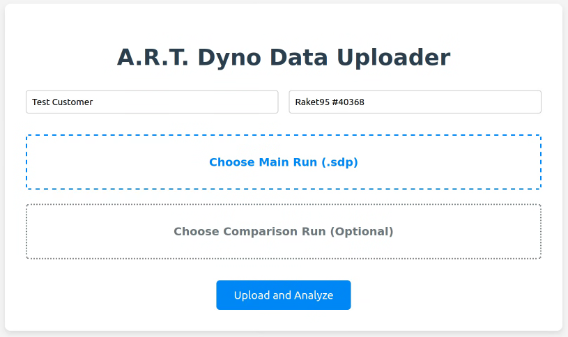

# Simple Dyno Web

## 1. Project Overview

This project is a web-based tool created to parse, visualize, and report on engine performance data. It is specifically designed to work with **`.sdp` files generated by the SimpleDyno application that contain `CURVE_FIT` data**. The tool provides a streamlined workflow for engine tuners to upload dynamometer run files, compare results, and export professional PDF reports.

## 2. Core Features

*   **Dual-Mode Operation**:
    *   **Web Server Mode**: Run `python3 app.py` to start a local web server. Users can upload files through a web form.
    *   **Command-Line Mode**: Run `python3 app.py <file1.sdp> [file2.sdp]` to immediately parse one or two files and have the results open automatically in a web browser.


*   **SimpleDyno `.sdp` File Parsing**:
    *   Supports the **`PRIMARY_CHANNEL_CURVE_FIT_DATA`** format.
    *   Extracts key configuration data (e.g., Gear Ratio, Roller Mass, Actual MOI).
    *   Parses the performance data table, correctly using the `Motor_Torque_(N.m)` and `Power_(W)` columns.

*   **Data Processing & Visualization**:
    *   Filters all data points below 5500 RPM to focus on the relevant power band.
    *   Converts units from rad/s to RPM and Watts to Horsepower (HP).
    *   Calculates and displays peak torque and peak power for each run.
    *   Renders an interactive Torque and Power vs. RPM chart using Chart.js.

*   **Run Comparison**:
    *   Allows a user to upload a second "comparison" file, which is overlaid on the chart as lighter, dashed lines for easy before-and-after analysis.

*   **Professional PDF Reporting**:
    *   An "Export to PDF" button generates a multi-page, A4 landscape report using a dedicated HTML template and the WeasyPrint library.
    *   **Page 1 (Summary)**: Includes a company logo, metadata (customer, engine), the performance chart, a summary data table, and footer boxes with peak values.
    *   **Page 2+ (Appendix)**: Contains the full, detailed data tables for each run on subsequent pages.

## 3. Project Structure
```
/project_directory/
├── app.py # Main Flask application logic
├── static/
│ └── logo.png # Logo for the Webpage
└── templates/
  ├── index.html # Initial upload page with metadata fields
  ├── results.html # Web page to display the chart and summary
  └── report.html # Dedicated HTML template for the PDF export
```
## 4. Prerequisites and Installation

To set up and run this project, you will need Python 3 and the `pip` package installer.

#### Required Modules

The project depends on the following Python libraries. It is highly recommended to use these specific versions to avoid dependency conflicts, especially between `weasyprint` and `pydyf`.
#### Installation Steps

1.  **Clone the Repository**:
    ```bash
    git clone git@github.com:NicNull/Simple-Dyno-Web.git
    cd Simple-Dyno-Web
    ```

2.  **Create a Virtual Environment** (Recommended):
    ```bash
    python3 -m venv venv
    source venv/bin/activate  # On Windows, use `venv\Scripts\activate`
    ```

3.  **Install Dependencies**:
    ```bash
    pip install -r requirements.txt
    ```

## 5. Usage

You can run the application in two ways from your terminal.

#### A. Web Server Mode

This mode starts a web server and allows you to upload files through your browser.

1.  Run the application:
    ```bash
    python3 app.py
    ```
2.  Open your web browser and navigate to:
    `http://127.0.0.1:5000`

3.  Fill in the metadata, upload your main `.sdp` file (and an optional comparison file), and click "Upload and Analyze".


4.  Validate the data shown and select Export to PDF if needed.

#### B. Command-Line Mode

This mode is a shortcut to parse one or two files directly.

1.  Run the application with file paths as arguments:
    ```bash
    # For a single run
    python3 app.py /path/to/your/main_run.sdp

    # For comparing two runs
    python3 app.py /path/to/main.sdp /path/to/comparison.sdp
    ```
2.  The script will automatically process the file(s) and open the results page in your default web browser.